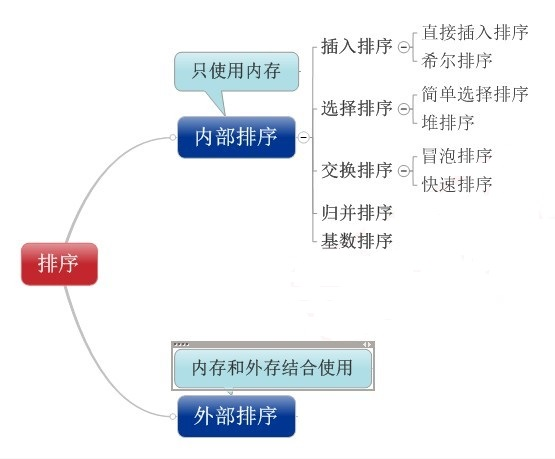

# 5.排序算法小结



### 六大排序算法：https://github.com/JackKuo666/Data_Structure_with_Python
1.[冒泡排序](https://github.com/JackKuo666/Data_Structure_with_Python/blob/master/5.1%E5%86%92%E6%B3%A1%E6%8E%92%E5%BA%8F.py)

2.[选择排序](https://github.com/JackKuo666/Data_Structure_with_Python/blob/master/5.2%E9%80%89%E6%8B%A9%E6%8E%92%E5%BA%8F.py)

3.[插入排序](https://github.com/JackKuo666/Data_Structure_with_Python/blob/master/5.3%E6%8F%92%E5%85%A5%E6%8E%92%E5%BA%8F.py)

4.[快速排序](https://github.com/JackKuo666/Data_Structure_with_Python/blob/master/5.4%E5%BF%AB%E9%80%9F%E6%8E%92%E5%BA%8F.py)

5.[希尔排序](https://github.com/JackKuo666/Data_Structure_with_Python/blob/master/5.5%E5%B8%8C%E5%B0%94%E6%8E%92%E5%BA%8F.py)

6.[归并排序](https://github.com/JackKuo666/Data_Structure_with_Python/blob/master/5.6.%E5%BD%92%E5%B9%B6%E6%8E%92%E5%BA%8F.py)

7.堆排序

https://www.jianshu.com/p/d174f1862601

https://www.runoob.com/python3/python-heap-sort.html

8.[计数排序](https://www.cnblogs.com/golzn2018/p/9594293.html)

9.桶排序

https://www.jianshu.com/p/bbbab7fa77a2

10.基数排序

https://www.jianshu.com/p/bbbab7fa77a2

11.图：拓扑排序

11.1. 入度为0法
https://blog.csdn.net/lanchunhui/article/details/50957608

11.2.递归+类
https://www.runoob.com/python3/python-topological-sorting.html


### 3.+

## 9大排序算法
```py

"""
1.冒泡排序：
最优时间复杂度：O(n)
最坏时间复杂度：O(n**2)
稳定
"""

def bubble_sort(a_list):
    for i in range(len(a_list)):
        for j in range(len(a_list)-i):
            if j+1 < len(a_list) - i:
                if a_list[j] > a_list[j+1]:
                    a_list[j], a_list[j+1] = a_list[j+1], a_list[j]
    return a_list

a_list = [54, 26, 93, 17, 77, 31, 44, 55, 20]
print(bubble_sort(a_list))


"""
2.选择排序
时间复杂度：O(n**2)
不稳定
"""
def selection_sort(a_list):
    n = len(a_list)
    for i in range(n-1):
        min_index = i
        for j in range(i+1,n):
            if a_list[j] < a_list[min_index]:
                min_index = j
        if min_index != i:
            a_list[i], a_list[min_index] = a_list[min_index], a_list[i]
    return a_list

a_list = [54, 26, 93, 17, 77, 31, 44, 55, 20]

print(selection_sort(a_list))


"""
3.插入排序
最优时间复杂度：O(n)
最坏时间复杂度：O(n**2)
稳定
"""

def insert_sort(a_list):
    for i in range(1, len(a_list)):
        for j in range(i, 0, -1):
            if a_list[j] < a_list[j-1]:
                a_list[j], a_list[j-1] = a_list[j-1], a_list[j]
    return a_list

a_list = [54, 26, 93, 17, 77, 31, 44, 55, 20]
print(insert_sort(a_list))


"""
4.快排
递归
最优时间复杂度：O(nlogn)
最坏时间复杂度：O(n**2)
不稳定
"""

def quick_sort(a_list, start, end):
    if start >= end:
        return

    pivot = a_list[start]

    i = start
    j = end

    while i < j:
        while i < j and a_list[j] >= pivot:
            j -= 1
        # 从右往左找，小于pivot的放在pivot位置上
        a_list[i] = a_list[j]

        while i < j and a_list[i] < pivot:
            i += 1
        # 从左往右找，大于pivot的放在刚才找到的j的位置
        a_list[j] = a_list[i]

    # 将pivot放在最后的i的位置
    a_list[i] = pivot

    # 对左边子序列进行快排
    quick_sort(a_list, start, i - 1)
    # 对右边子序列进行快排
    quick_sort(a_list, i+1, end)

a_list = [54, 26, 93, 17, 77, 31, 44, 55, 20]
quick_sort(a_list, 0, len(a_list)-1)
print(a_list)


"""
5.希尔排序
最坏时间复杂度：O(n**2)
不稳定
"""

def shell_sort(a_list):
    n = len(a_list)
    gap = n // 2
    while gap > 0:
        for i in range(gap, n):
            j = i
            # 插入排序
            while j >= gap and a_list[j-gap] > a_list[j]:
                a_list[j-gap], a_list[j] = a_list[j], a_list[j-gap]
                j -= gap
        gap = gap // 2

    return a_list

a_list = [54, 26, 93, 17, 77, 31, 44, 55, 20]
print(shell_sort(a_list))


"""
6.归并排序
递归
时间复杂度:O(nlogn)
稳定
"""

def merge_sort(a_list):
    n = len(a_list)
    if  n<= 1:
        return a_list
    # 拆分
    left = merge_sort(a_list[:n//2])
    right = merge_sort(a_list[n//2:])
    # 合并排序
    return merge(left, right)

def merge(left, right):
    l = r = 0
    result = []
    while l < len(left) and r < len(right):
        if left[l] < right[r]:
            result.append(left[l])
            l += 1
        else:
            result.append(right[r])
            r += 1
    result += left[l:]
    result += right[r:]
    return result


a_list = [54, 26, 93, 17, 77, 31, 44, 55, 20]
print(merge_sort(a_list))

"""
7.堆排序
时间复杂度：O(nlogn)
不稳定
https://www.jianshu.com/p/d174f1862601
https://www.runoob.com/python3/python-heap-sort.html
"""
## 一、大顶堆

# 2.动态规划构建大顶堆
def heap_build_2(self, a_list, n, i):
    temp = a_list[i]
    j = i*2 + 1
    while j < n:
        if j+1 < n and a_list[j+1] > a_list[j]: # 第二个改为 < 就是小顶堆       
            j += 1
        if a_list[j] < a_list[i]:  # 改为 > 就是小顶堆
            break
        a_list[i] = a_list[j]
        i = j
        j = i*2 + 1
    a_list[i] = temp

# 1.递归方式构建大顶堆 
def heap_build(a_list, n, i):
    largest = i
    l = 2 * i + 1
    r = 2 * i + 2

    if l < n and a_list[l] > a_list[largest]:  # 第二个改为 < 就是小顶堆 
        largest = l
    if r < n and a_list[r] > a_list[largest]:  # 第二个改为 < 就是小顶堆 
        largest = r

    if largest != i:
        a_list[largest], a_list[i] = a_list[i], a_list[largest]

        # 调整子树，构建大根堆
        heap_build(a_list, n, largest)

def heap_sort(a_list):
    n = len(a_list)

    # 构建大顶堆
    for i in range(n, -1, -1):
        heap_build(a_list, n, i)

    # 交换元素
    for i in range(n-1, 0, -1):
        a_list[0], a_list[i] = a_list[i], a_list[0]
        heap_build(a_list, i, 0)

    return a_list


a_list = [54, 26, 93, 17, 77, 31, 44, 55, 20]
print(heap_sort(a_list))


"""
8.计数排序
时间复杂度:O(n**2)
https://www.cnblogs.com/golzn2018/p/9594293.html
"""

def count_sort(a_list):
    n = len(a_list)
    idx = [0]*n
    ans = [0]*n
    for i in range(n):
        for j in range(i+1, n):
            if a_list[i] > a_list[j]:
                idx[i] += 1
            else:
                idx[j] += 1
        ans[idx[i]] = a_list[i]
    return ans

a_list = [54, 26, 93, 17, 77, 31, 44, 55, 20]
print(count_sort(a_list))


"""
9.拓扑排序
有向无环图
"""

"""
9.1. 入度为0法
https://blog.csdn.net/lanchunhui/article/details/50957608
"""

def top_sort(G):
    # 存放所有节点的入度
    in_degrees = dict((k,0) for k in G)
    for k in G:
        for v in G[k]:
            in_degrees[v] += 1

    Q = [k for k in G if in_degrees[k] == 0] # 入度为0的节点

    S = []
    while Q:
        k = Q.pop()

        S.append(k)

        for v in G[k]:
            in_degrees[v] -= 1
            if in_degrees[v] == 0:
                Q.append(v)
    return S


G = {
    'a':'bf',
    'b':'cdf',
    'c':'d',
    'd':'ef',
    'e':'f',
    'f':''
    }
print(top_sort(G))
# output:
# ['a', 'b', 'c', 'd', 'e', 'f']

G = {
    5: [2,0],
    4: [0,1],
    2: [3],
    3: [1],
    0: [],
    1: []
}
print(top_sort(G))
# output:
# [4, 5, 0, 2, 3, 1]


"""
2.递归+类
https://www.runoob.com/python3/python-topological-sorting.html
"""

from collections import defaultdict


class Graph:
    def __init__(self, vertices):
        self.graph = defaultdict(list)
        self.V = vertices

    def addEdge(self, u, v):
        self.graph[u].append(v)

    def topologicalSortUtil(self, v, visited, stack):

        visited[v] = True

        for i in self.graph[v]:
            if visited[i] == False:
                self.topologicalSortUtil(i, visited, stack)

        stack.insert(0, v)

    def topologicalSort(self):
        visited = [False] * self.V
        stack = []

        for i in range(self.V):
            if visited[i] == False:
                self.topologicalSortUtil(i, visited, stack)

        print(stack)
        return stack

g = Graph(6)
g.addEdge(5, 2)
g.addEdge(5, 0)
g.addEdge(4, 0)
g.addEdge(4, 1)
g.addEdge(2, 3)
g.addEdge(3, 1)

g.topologicalSort()
# [5, 4, 2, 3, 1, 0]


G = {
    'a':'bf',
    'b':'cdf',
    'c':'d',
    'd':'ef',
    'e':'f',
    'f':''
    }

a_dict = {v: k for k,v in enumerate("abcdef")}
b_dict = {k: v for k,v in enumerate("abcdef")}
# 将G转化为0-6
m = Graph(6)
for k in G:
    if G[k]:
        for v in G[k]:
            m.addEdge(a_dict[k], a_dict[v])

stack = m.topologicalSort()
# 将0-6转化为a-f
stack = [b_dict[i] for i in stack]
print(stack)
# ['a', 'b', 'c', 'd', 'e', 'f']
```
